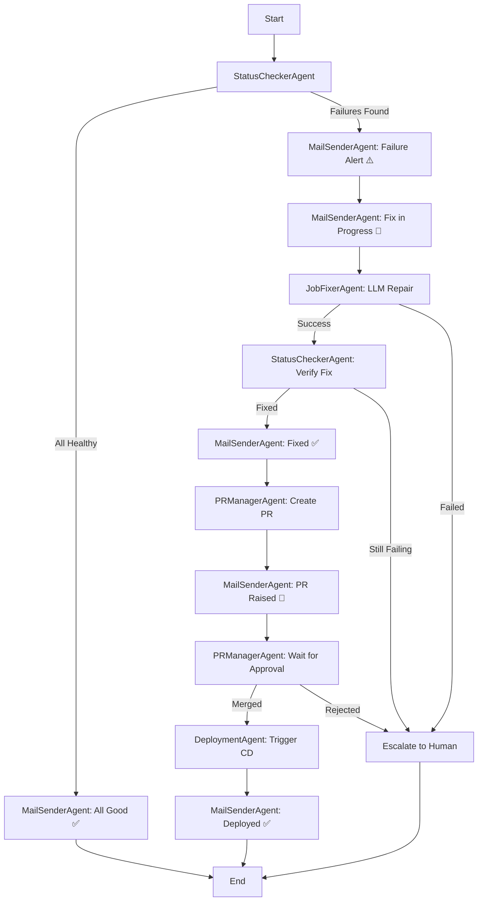

# 🛡️ AEGIS — AI-Engine for Guardian Intelligence & Self-healing

> **Hackathon:** AI-Autonomous Reliability Engineer | Data DevOps & MLOps Track  
> **Theme:** Self-Healing Data & ML Systems

---

## Problem Statement

In production Data and ML systems, most incidents are repetitive and predictable — schema drift, data quality regressions, upstream delays, and model degradation — yet recovery is still manual. Engineers are paged, correlate logs across fragmented tools, apply known fixes, and document outcomes. This creates high MTTR, alert fatigue, and avoidable business impact.

**AEGIS solves this by building a governed autonomous reliability layer that detects, diagnoses, and heals common incidents in real time.**

---

## 🎯 Quick Start — Live Dashboard

**NEW:** AEGIS now includes a comprehensive real-time Streamlit dashboard!

```powershell
# Launch the dashboard
streamlit run app_aegis_live.py

# Or use the launcher script
.\run_dashboard.ps1
```

**Dashboard opens at:** http://localhost:8501

### 📊 Dashboard Features

- **🎛️ Job Selection**: Interactive dropdown to select Databricks jobs
- **🚀 One-Click Start**: Launch full autonomous workflow from UI
- **📈 Real-Time Progress**: Live tracking through all 15 nodes
- **📝 Live Logs**: Streaming logs with color-coded levels
- **📊 Analytics**: MTTR trends, success rates, incident history
- **🔗 Quick Links**: Direct access to Databricks, GitHub PRs, and deployments
- **⏱️ Waiting Indicators**: See exactly where AEGIS is in the workflow
- **🎨 Light Theme**: Visually rich, gradient backgrounds, smooth animations

**See [DASHBOARD_GUIDE.md](docs/DASHBOARD_GUIDE.md) for complete documentation.**

---

## Solution — The Full Loop

```
DETECT → DIAGNOSE → DECIDE → HEAL → NOTIFY → REPORT → LEARN
```

| Stage | What Happens |
|---|---|
| **Detect** | Monitors jobs, Delta tables, model metrics, and data quality in real-time |
| **Diagnose** | LLM-powered RCA using logs + lineage + metrics + incident history |
| **Decide** | Policy engine gates: auto-heal vs. human approval based on confidence + risk |
| **Heal** | Retry / Rollback / Schema patch / Model rollback / Retrigger |
| **Notify** | Teams/Slack adaptive card with full incident context |
| **Report** | Structured incident report with timeline, root cause, action, prevention |
| **Learn** | Stores every resolved incident in vector knowledge base for future RCA enrichment |

---

## Architecture — Multi-Agent LangGraph Orchestration

AEGIS uses **LangGraph** to orchestrate 6 specialized agents in a state machine workflow. Each agent handles one aspect of the reliability lifecycle, with **8-stage email notifications** providing full visibility.

### Multi-Agent System



### 6 Autonomous Agents

| Agent | Responsibility | Key Actions |
|---|---|---|
| **StatusCheckerAgent** | Health monitoring | List all DAB jobs, check last run status, extract error traces |
| **MailSenderAgent** | Notifications | Send 8-stage emails (non-blocking, async) |
| **JobFixerAgent** | Self-healing | Fetch notebook → GPT-5.5 repair → upload → verify |
| **PRManagerAgent** | GitOps sync | Create PR, poll for approval/merge (indefinite wait) |
| **DeploymentAgent** | CI/CD automation | Trigger GitHub Actions CD, monitor completion |
| **PostDeploymentVerifier** | Health re-check | Verify job health after deployment |

### 8-Stage Email Notifications

1. **Initial Health Check** — "All jobs healthy ✅" or "Failures detected ⚠️"
2. **Failure Alert** — Job name, error trace, GPT-5.5 RCA, confidence %
3. **Fix in Progress** — "GPT-5.5 is fixing notebook X..."
4. **Fix Complete** — "Job re-run successful ✅", MTTR
5. **PR Raised** — PR link, "awaiting manual approval"
6. *(No email during PR wait)*
7. **Final Confirmation** — "Full cycle complete ✅, job verified healthy"
8. **Deployment Failed** — "Post-deployment job still failing ❌, escalating to human"

### LangGraph State Machine

```python
class AEGISState(TypedDict):
    # Configuration
    monitor_all_jobs: bool         # True = all DAB jobs, False = specific job
    specific_job_id: str | None
    dab_bundle_name: str | None    # Filter jobs by bundle tag
    
    # Health Reports
    job_health_reports: List[Dict]
    has_failures: bool
    
    # Current Incident
    current_incident_id: str
    root_cause: str
    confidence: float
    
    # Fix Results
    fix_status: str
    fixed_notebooks: List[Dict]
    post_fix_run_id: int
    
    # PR & Deployment
    pr_url: str
    pr_merged: bool
    workflow_run_url: str
```

### Conditional Routing

- **After Status Check**: If failures → failure_alert, else → end
- **After Fix**: If success → create_pr, else → escalate
- **After PR Wait**: If merged → deployment, else → escalate

---

## Original Single-Threaded Architecture (Legacy)

```
[ Databricks Jobs ]  [ Delta Tables ]  [ MLflow Models ]
         │                  │                  │
         └──────────────────┼──────────────────┘
                            │
                   ┌────────▼────────┐
                   │ Failure Detector│  ← polls every 30s
                   └────────┬────────┘
                            │
                   ┌────────▼────────┐
                   │Context Assembler│  ← logs + lineage + history
                   └────────┬────────┘
                            │
                   ┌────────▼────────┐
                   │  LLM RCA Agent  │  ← GPT-4o reasons over all signals
                   └────────┬────────┘
                            │
                   ┌────────▼────────┐
                   │  Policy Engine  │  ← confidence + risk gate
                   └───┬────────┬───┘
                       │        │
              ┌────────▼─┐  ┌───▼──────────────┐
              │Auto-Heal │  │Human Approval Flow│
              └────────┬─┘  └───┬──────────────┘
                       │        │
              ┌────────▼────────▼──┐
              │  Incident Reporter  │
              └────┬──────────┬────┘
                   │          │
         ┌─────────▼──┐  ┌────▼──────────┐
         │Teams Alert │  │ GitHub Hotfix │
         └────────────┘  │     PR        │
                         └───────────────┘
```

---

## Project Structure

```
aegis/
├── config/
│   └── config.yaml                # All thresholds, policy rules, integration settings
├── src/
│   ├── models.py                  # Shared data models (FailureType, RCAResult, etc.)
│   ├── agents/                    # ⭐ NEW: Multi-agent system
│   │   ├── status_checker.py      # Health monitoring agent
│   │   ├── mail_sender.py         # 6-stage email notification agent
│   │   ├── job_fixer.py           # LLM-powered notebook repair agent
│   │   ├── pr_manager.py          # PR creation & approval polling agent
│   │   └── deployment.py          # CD automation agent
│   ├── workflow.py                # ⭐ LangGraph state machine orchestration
│   ├── detection/
│   │   └── failure_detector.py    # Job, data quality, schema, model monitoring
│   ├── diagnosis/
│   │   ├── context_assembler.py   # Aggregates logs, metrics, lineage, history
│   │   └── rca_agent.py           # LLM-powered root cause analysis
│   ├── healing/
│   │   ├── policy_engine.py       # Auto-heal vs escalate decision gate
│   │   └── heal_orchestrator.py   # Retry, rollback, schema fix, retrigger
│   ├── reporting/
│   │   ├── incident_reporter.py   # Orchestrates Teams + PR + report
│   │   ├── teams_notifier.py      # Adaptive card Teams notification
│   │   ├── gmail_notifier.py      # ⭐ NEW: Gmail SMTP notifications
│   │   └── pr_creator.py          # GitHub auto-PR with explanation
│   ├── knowledge/
│   │   └── incident_store.py      # ChromaDB vector store for past incidents
│   └── main.py                    # Original single-threaded orchestrator (legacy)
├── de_project/                    # ⭐ NEW: DAB Data Engineering project
│   ├── databricks.yml             # Bundle configuration
│   ├── resources/jobs/            # Job definitions
│   └── notebooks/                 # Pipeline notebooks (ingest, transform, validate)
├── .github/workflows/             # ⭐ NEW: GitHub Actions CI/CD
│   ├── ci.yml                     # Lint + bundle validate on PR
│   └── cd.yml                     # Deploy + destroy on merge
├── demo/
│   ├── production_multi_agent.py  # ⭐ NEW: Multi-agent entry point
│   ├── production_run.py          # Single-threaded production demo
│   ├── run_demo.py                # Interactive hackathon demo script
│   └── quick_test.py              # Non-interactive test of all failure types
├── app_streamlit.py               # ⭐ NEW: Streamlit dashboard (basic)
├── app_dashboard.py               # ⭐ NEW: Streamlit dashboard (advanced with real-time progress)
├── docs/
│   ├── CURRENT_BEHAVIOR_ANALYSIS.md  # ⭐ NEW: Architecture analysis
│   ├── MULTI_AGENT_ARCHITECTURE.md   # ⭐ NEW: Multi-agent system design
│   ├── IMPLEMENTATION_SUMMARY.md     # ⭐ NEW: Implementation summary
│   ├── STREAMLIT_DASHBOARD_GUIDE.md  # ⭐ NEW: Dashboard usage guide
│   ├── CODE_EXPLANATION.md
│   └── PREREQUISITES.md
├── requirements.txt
├── .env.example
└── README.md
```

---

## Quick Start

### 1. Clone and Install

```bash
git clone https://github.com/uday2797/aegis.git
cd aegis
pip install -r requirements.txt
```

### 2. Configure Environment

```bash
cp .env.example .env
# Edit .env with your settings:
# - Databricks: DATABRICKS_HOST, DATABRICKS_TOKEN
# - LLM: DIAL_API_KEY (or Azure OpenAI)
# - GitHub: GITHUB_TOKEN, GITHUB_REPO_OWNER, GITHUB_REPO_NAME
# - Email: GMAIL_SENDER, GMAIL_APP_PASSWORD, GMAIL_RECIPIENTS
```

### 3. Deploy DAB Data Engineering Project

```bash
cd de_project
databricks bundle deploy --target dev
databricks bundle run aegis_data_pipeline
cd ..
```

### 4. Run Multi-Agent Production Mode (⭐ NEW)

```bash
python demo/production_multi_agent.py
```

This runs the full LangGraph workflow:
- ✅ Monitors all DAB jobs (or specific job via `DATABRICKS_JOB_ID`)
- ✅ Sends 6-stage email notifications
- ✅ GPT-4o autonomous notebook repair
- ✅ Creates GitHub PR with fixes
- ✅ Waits for PR approval
- ✅ Triggers GitHub Actions CD redeploy

### 5. Alternative: Single-Threaded Legacy Mode

```bash
python demo/production_run.py
```

### 6. Run Quick Test (validates all components)

```bash
python demo/quick_test.py
```

### 7. 🎨 Run Streamlit Dashboard (⭐ NEW — For Hackathon Demo)

```bash
streamlit run app_dashboard.py
```

**Visual demo interface** for hackathon judges featuring:
- ✅ Real-time job health monitoring with color-coded status
- ✅ One-click "Run AEGIS" button with live 10-stage progress visualization
- ✅ Animated metrics dashboard (MTTR trends, incident distribution)
- ✅ Interactive charts with Plotly (MTTR trend line, status pie chart)
- ✅ Configuration status panel (Databricks, LLM, GitHub, Gmail)
- ✅ Live execution logs and results display
- ✅ Professional UI with gradient styling and smooth animations

**Opens at:** `http://localhost:8501`

**See full guide:** [docs/STREAMLIT_DASHBOARD_GUIDE.md](docs/STREAMLIT_DASHBOARD_GUIDE.md)

---

## Environment Variables

```bash
# Databricks
DATABRICKS_HOST=https://dbc-xxx.cloud.databricks.com/
DATABRICKS_TOKEN=dapixxx
DATABRICKS_JOB_ID=123456789  # (optional) specific job to monitor

# DAB Bundle (for multi-job monitoring)
DAB_BUNDLE_NAME=aegis-de-project

# EPAM DIAL API (GPT-4o for RCA)
DIAL_API_KEY=dial-xxx
DIAL_API_ENDPOINT=https://ai-proxy.lab.epam.com
DIAL_DEPLOYMENT=gpt-4o
DIAL_API_VERSION=2025-04-01-preview

# GitHub (for PR creation and CD trigger)
GITHUB_TOKEN=ghp_xxx
GITHUB_REPO_OWNER=uday2797
GITHUB_REPO_NAME=aegis

# Gmail (for 6-stage notifications)
GMAIL_SENDER=your-email@gmail.com
GMAIL_APP_PASSWORD=xxxx xxxx xxxx xxxx  # 16-char App Password
GMAIL_RECIPIENTS=recipient1@example.com,recipient2@example.com

# Mode
SIMULATION_MODE=false  # Set to true for demo mode without real Databricks
```

---

## Configuration

All behaviour is controlled via `config/config.yaml`:

```yaml
policy:
  auto_heal_confidence_min: 85   # Minimum confidence % for auto-healing
  low_risk_types:                # These are always auto-healed if confidence >= 60%
    - transient_failure
    - upstream_delay
    - data_corruption
  high_risk_types:               # These always require human approval
    - infra_failure
    - config_mismatch
```

---

## Failure Types Supported

| Failure | Detection Method | Healing Action |
|---|---|---|
| Schema Drift | Column name/type diff vs. baseline | Generate mapping patch + PR |
| Data Corruption | Null spike / row count drop | Delta rollback + retrigger |
| Transient Failure | Exit code != 0 + network error pattern | Retry with backoff |
| Upstream Delay | Runtime > 3x P95 baseline | Wait + retrigger downstream |
| Model Drift | PSI > 0.20 on prediction distribution | Rollback model + retrain |
| Data Quality | Null %, distribution outliers | Quarantine + backfill |

---

## Tech Stack

| Component | Technology |
|---|---|
| LLM Brain | Azure OpenAI GPT-4o (via EPAM DIAL API) |
| Multi-Agent Orchestration | **LangGraph** state machine ⭐ |
| Agent Framework | LangChain + async Python |
| ML Monitoring | Evidently AI (PSI, KS-test) |
| Data Quality | Great Expectations |
| Knowledge Store | ChromaDB (vector DB) |
| Notifications | Gmail SMTP + Microsoft Teams Adaptive Cards |
| PR Creation | GitHub REST API (PyGithub) |
| CI/CD | GitHub Actions + Databricks Asset Bundles (DABs) |
| Config | YAML + python-dotenv |
| Logging | Loguru + Rich terminal |

---

## Demo Winning Metrics

| Metric | Before AEGIS | With AEGIS |
|---|---|---|
| MTTR (avg) | 45 minutes | ~90 seconds |
| Auto-heal rate | 0% | 80%+ |
| False positive rate | N/A | <5% |
| Engineer pages | 100% incidents | ~20% (high-risk only) |

---

## AI Components

1. **LLM RCA Agent** — GPT-4o reasons across logs + lineage + history → structured root cause + confidence
2. **Context Assembler** — aggregates all signals into a rich prompt for the LLM
3. **Rule-Based Fallback** — deterministic RCA when LLM is unavailable (no dependency on internet)
4. **Vector Knowledge Store** — semantic retrieval of similar past incidents for RCA enrichment
5. **AI PR Description Generator** — LLM-written hotfix PR with explanation and risk assessment

---

## Prerequisites

See [PREREQUISITES.md](docs/PREREQUISITES.md) for full setup.

Minimum to run demo:
- Python 3.11+
- `pip install -r requirements.txt`
- `SIMULATION_MODE=true` in `.env` (no external dependencies needed)

To enable LLM RCA:
- Azure OpenAI resource with GPT-4o deployment

To enable Teams alerts:
- Teams incoming webhook URL

To enable real GitHub PRs:
- GitHub personal access token + repo access

---

*AEGIS — Because your data systems deserve an engineer that never sleeps.*
