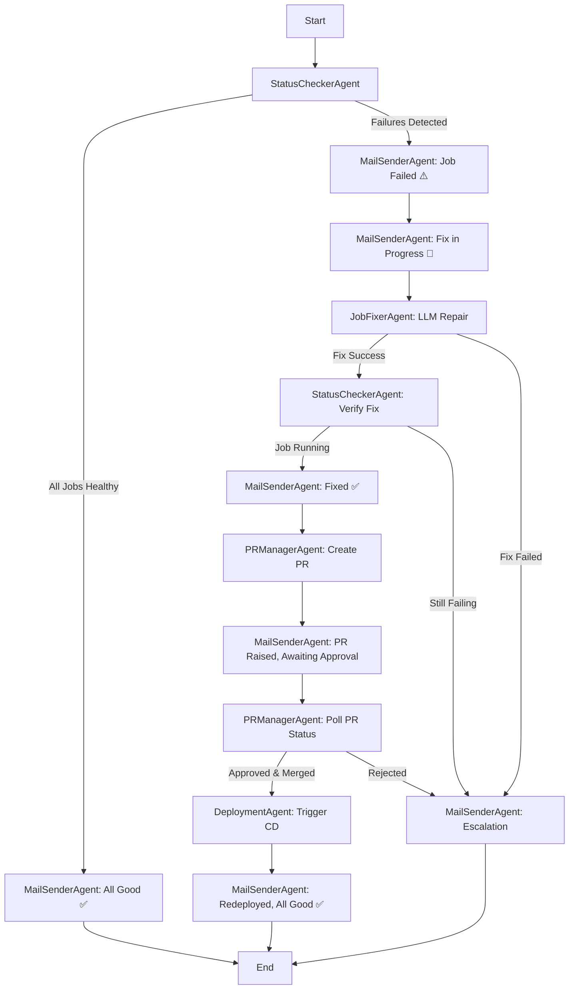

# AEGIS Current Behavior Analysis

## Current Architecture (Single-Threaded)

### Components
1. **FailureDetector** (`src/detection/failure_detector.py`)
   - Monitors **ONE** Databricks job (from `DATABRICKS_JOB_ID` env var)
   - Fetches real Python error traces from failed task runs
   - Classifies failures: `transient_failure`, `data_quality`, `data_corruption`, etc.

2. **RCAAgent** (`src/diagnosis/rca_agent.py`)
   - GPT-4o powered root cause analysis via EPAM DIAL API
   - Returns: root cause, confidence (0-100%), risk level (LOW/MEDIUM/HIGH)
   - Falls back to rule-based diagnosis if DIAL unavailable

3. **PolicyEngine** (`src/healing/policy_engine.py`)
   - Decides if auto-healing is safe based on confidence + risk level
   - Approves if: confidence ≥ 80% AND risk = LOW

4. **HealOrchestrator** (`src/healing/heal_orchestrator.py`)
   - **Current Mode (after latest changes)**: Direct LLM heal (no retries)
   - In production: fetches last error → GPT-4o fixes notebook → uploads to Databricks → runs job
   - Returns `HealResult` with `has_code_fix=True` and `fix_files[]` for PR creation

5. **PRCreator** (`src/reporting/pr_creator.py`)
   - Creates GitHub PR on `uday2797/aegis` repo
   - Branch: `aegis-hotfix/{failure_type}/{incident_id}`
   - Commits fixed notebooks to `de_project/notebooks/*.py`
   - **Waits for manual review** (no auto-merge)

6. **GmailNotifier** (`src/reporting/gmail_notifier.py`)
   - Sends **ONE** email at the end with full incident report
   - **Blocking** (SMTP timeouts delay healing)
   - Email includes: MTTR, root cause, action taken, PR URL

7. **GitHub Actions CI/CD** (`.github/workflows/`)
   - **CI** (`ci.yml`): Triggered on PR to main
     - Runs pyflakes lint
     - Runs `databricks bundle validate`
     - Labels PR if title contains `[AEGIS Auto-Fix]`
   - **CD** (`cd.yml`): Triggered on push to main
     - Runs `databricks bundle deploy --target prod`
     - **NO DESTROY STEP**

### Current Flow (Single Pass)
```
1. FailureDetector.monitor() → DetectedIncident
2. ContextAssembler.assemble() → adds similar incidents from knowledge store
3. RCAAgent.diagnose() → RCAResult (GPT-4o)
4. PolicyEngine.should_auto_heal() → bool, reason
5. IF approved:
   a. HealOrchestrator.heal() → direct_llm_heal() → fix_notebook_and_retry()
      - Fetch notebook from Databricks
      - GPT-4o fixes code
      - Upload fixed notebook
      - Run job
      - Return HealResult with fix_files[]
6. PRCreator.create() → creates PR (if has_code_fix=True)
7. GmailNotifier.send() → ONE email at end (blocking, often times out)
8. IncidentStore.store() → ChromaDB for future context
9. DONE — AEGIS exits, waits for manual PR approval
```

### Limitations
1. **Single Job Monitoring**: Only monitors `DATABRICKS_JOB_ID` from .env
   - Cannot discover/monitor all DAB jobs dynamically
   - Hard to scale to multi-job pipelines

2. **Single Email Notification**: Only sends final report
   - No initial health check email
   - No fix-in-progress notification
   - No PR-raised notification
   - No redeployment confirmation

3. **Blocking SMTP**: Email send blocks healing flow
   - 30s timeout × 2 attempts = 60s delay
   - Often fails due to network (port 587 blocked)

4. **No PR Approval Monitoring**: Creates PR and exits
   - Doesn't wait for approval
   - Doesn't trigger CD redeploy after merge
   - Manual user action required to complete GitOps loop

5. **No Destroy Step in CD**: Bundle resources not cleaned up
   - Old runs/jobs may linger
   - No teardown automation

6. **Linear Flow**: Single-threaded, no parallelism
   - Status check → Fix → PR → Email (sequential)
   - Cannot do concurrent health checks across multiple jobs

---

## Proposed Architecture (Multi-Agent with LangGraph)

### Multi-Agent State Machine



### Agents

1. **StatusCheckerAgent**
   - **Input**: Databricks workspace host, token
   - **Actions**:
     - List all jobs in workspace (optionally filter by DAB tags)
     - Get latest run for each job
     - Check health: SUCCESS = healthy, FAILED = unhealthy
   - **Output**: `JobHealthReport[]` with job_id, name, status, error_summary

2. **MailSenderAgent**
   - **Input**: Stage name, data (job status, PR URL, etc.)
   - **Actions**: Send non-blocking email via asyncio.create_task()
   - **Stages**:
     1. **Initial Health Check**: "All jobs healthy ✅" or "Failures detected ⚠️"
     2. **Failure Notification**: Job name, error trace, RCA summary
     3. **Fix in Progress**: "GPT-4o is fixing notebook X..."
     4. **Fix Complete**: "Job re-run successful ✅"
     5. **PR Raised**: "PR #N created, awaiting manual approval" + link
     6. **Redeployment Complete**: "CD pipeline finished, all jobs healthy ✅"

3. **JobFixerAgent**
   - **Input**: Failed job details, error trace
   - **Actions**:
     - Fetch notebook source from Databricks
     - Call GPT-4o via DIAL API to fix code
     - Upload fixed notebook
     - Trigger job run
     - Poll until SUCCESS or FAILED
   - **Output**: `FixResult` with status, fixed_files[], new_run_id

4. **PRManagerAgent**
   - **Input**: Fixed files, incident details
   - **Actions**:
     - Create branch: `aegis-hotfix/{incident_id}`
     - Commit fixed notebooks to git repo
     - Create PR with AI-generated description
     - **NEW**: Poll PR status every 60s (check if merged)
   - **Output**: PR URL, merge status

5. **DeploymentAgent**
   - **Input**: Merged PR SHA
   - **Actions**:
     - Trigger GitHub Actions CD workflow via GitHub API
     - Poll workflow run status
     - Wait for `databricks bundle deploy --target prod` to complete
   - **Output**: Deployment status, workflow run URL

### LangGraph State

```python
class AEGISState(TypedDict):
    # Input
    workspace_host: str
    workspace_token: str
    monitor_all_jobs: bool  # True = all DAB jobs, False = specific job_id
    specific_job_id: Optional[str]
    
    # Status Check
    job_health_reports: List[Dict]  # [{"job_id": ..., "status": ..., "error": ...}]
    has_failures: bool
    
    # Diagnosis
    rca_results: Dict[str, RCAResult]  # {job_id: RCAResult}
    
    # Healing
    fix_results: Dict[str, FixResult]  # {job_id: FixResult}
    
    # PR & Deployment
    pr_url: Optional[str]
    pr_merged: bool
    deployment_status: str
    
    # Email tracking
    emails_sent: List[str]  # ["initial_check", "failure_alert", "fix_progress", ...]
```

### LangGraph Workflow

```python
from langgraph.graph import StateGraph, END

workflow = StateGraph(AEGISState)

# Add nodes
workflow.add_node("status_check", status_checker_agent)
workflow.add_node("mail_sender", mail_sender_agent)
workflow.add_node("job_fixer", job_fixer_agent)
workflow.add_node("pr_manager", pr_manager_agent)
workflow.add_node("deployment", deployment_agent)

# Add edges
workflow.set_entry_point("status_check")
workflow.add_conditional_edges(
    "status_check",
    lambda s: "all_good" if not s["has_failures"] else "failures",
    {
        "all_good": "mail_sender",  # Send "all good" email → END
        "failures": "mail_sender",  # Send failure alert → fix
    }
)
workflow.add_edge("mail_sender", "job_fixer")  # After failure email, fix job
workflow.add_edge("job_fixer", "status_check")  # Verify fix
workflow.add_conditional_edges(
    "job_fixer",
    lambda s: "fixed" if all(f.status == "success" for f in s["fix_results"].values()) else "escalate",
    {
        "fixed": "pr_manager",
        "escalate": "mail_sender",  # Send escalation email → END
    }
)
workflow.add_edge("pr_manager", "mail_sender")  # Send PR raised email
workflow.add_edge("mail_sender", "pr_manager")  # Wait for approval
workflow.add_conditional_edges(
    "pr_manager",
    lambda s: "merged" if s["pr_merged"] else "waiting",
    {
        "merged": "deployment",
        "waiting": "pr_manager",  # Keep polling
    }
)
workflow.add_edge("deployment", "mail_sender")  # Send final email
workflow.add_edge("mail_sender", END)

app = workflow.compile()
```

---

## Implementation Plan

### Phase 1: Multi-Agent Framework
- [ ] Install `langgraph` package
- [ ] Create `src/agents/` directory
- [ ] Implement `StatusCheckerAgent` with dynamic job discovery
- [ ] Implement `MailSenderAgent` with 6 notification stages
- [ ] Make email sends non-blocking (asyncio.create_task)

### Phase 2: Agent Logic
- [ ] Implement `JobFixerAgent` (refactor from `HealOrchestrator`)
- [ ] Implement `PRManagerAgent` (refactor from `PRCreator` + add polling)
- [ ] Implement `DeploymentAgent` (GitHub Actions trigger via API)

### Phase 3: LangGraph Orchestration
- [ ] Define `AEGISState` TypedDict
- [ ] Build LangGraph workflow with conditional edges
- [ ] Replace `main.py` single-threaded flow with LangGraph execution

### Phase 4: GitHub Actions
- [ ] Add `destroy` job to `cd.yml` with manual approval
- [ ] Add workflow dispatch trigger for `DeploymentAgent`

### Phase 5: Documentation
- [ ] Update `README.md` with multi-agent architecture diagram
- [ ] Create `docs/ARCHITECTURE.md` with detailed design
- [ ] Update `docs/CODE_EXPLANATION.md`
- [ ] Add `docs/MULTI_AGENT_DESIGN.md`

---

## Benefits of Multi-Agent Architecture

1. **Scalability**: Monitor all DAB jobs in parallel, not just one
2. **Observability**: 6 email stages provide full visibility into healing lifecycle
3. **Resilience**: Non-blocking emails don't delay critical healing actions
4. **Autonomy**: Waits for PR approval and auto-triggers CD redeploy
5. **Composability**: Agents are modular, can be reused/extended
6. **Hackathon Impact**: LangGraph multi-agent system impresses judges ✨
