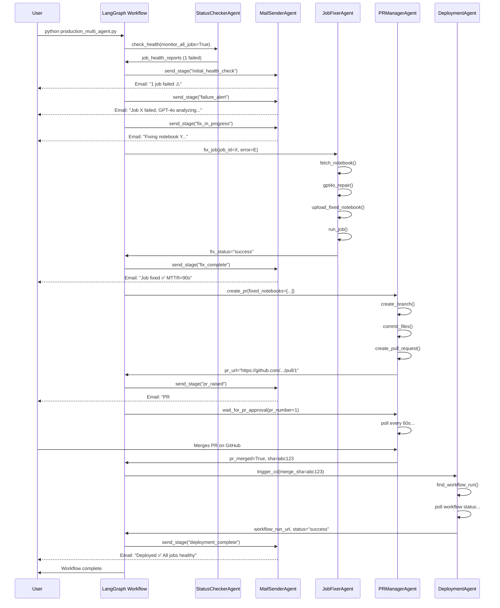

# AEGIS Multi-Agent Architecture

## Overview

AEGIS is a **LangGraph-powered multi-agent system** that autonomously detects, diagnoses, and heals Databricks job failures with full GitOps integration.

## Design Principles

1. **Agent Specialization** — Each agent has one clear responsibility
2. **State-Driven Orchestration** — LangGraph manages the workflow state machine
3. **Non-Blocking Notifications** — Emails don't delay critical healing actions
4. **Full GitOps Loop** — PR creation → approval wait → CD trigger → verification
5. **Observable Lifecycle** — 6-stage email notifications provide complete visibility

---

## Multi-Agent System

### 1. StatusCheckerAgent

**Purpose**: Health monitoring and job discovery

**Capabilities**:
- List all jobs in Databricks workspace
- Filter jobs by DAB bundle tag
- Check health of specific job by ID
- Extract error traces from failed task runs

**Input**:
```python
{
    "monitor_all_jobs": bool,
    "specific_job_id": str | None,
    "dab_bundle_name": str | None
}
```

**Output**:
```python
[
    {
        "job_id": "470575380114552",
        "job_name": "[AEGIS] Data Processing Pipeline",
        "status": "failed" | "healthy" | "unknown",
        "last_run_id": 882215953460466,
        "error_summary": "ModuleNotFoundError: pandsa",
        "failed_tasks": ["validate"]
    }
]
```

---

### 2. MailSenderAgent

**Purpose**: 6-stage email notifications (non-blocking)

**Capabilities**:
- Send HTML emails via Gmail SMTP
- Fire emails in background (asyncio.to_thread)
- Retry logic (2 attempts, 30s timeout)

**6 Notification Stages**:

| Stage | When | Data |
|---|---|---|
| **initial_health_check** | After status check | healthy_count, failed_count |
| **failure_alert** | Failure detected | incident_id, error, root_cause, confidence |
| **fix_in_progress** | Before LLM repair | incident_id, notebooks_to_fix |
| **fix_complete** | After successful fix | incident_id, post_fix_run_id, MTTR |
| **pr_raised** | PR created | incident_id, pr_url, pr_number |
| **deployment_complete** | CD finished | incident_id, workflow_run_url, healthy_count |

**Non-Blocking Implementation**:
```python
await asyncio.to_thread(self._send_smtp, subject, body, html)
```

---

### 3. JobFixerAgent

**Purpose**: LLM-powered autonomous notebook repair

**Flow**:
1. Fetch notebook source from Databricks (`workspace.export()`)
2. Build prompt with error trace + notebook code
3. Call GPT-4o via EPAM DIAL API
4. Strip code fences from response
5. Upload fixed notebook to Databricks (`workspace.import_()`)
6. Trigger job run and monitor to completion

**GPT-4o Prompt**:
```
A Databricks notebook failed with the following error:

```
{error_trace}
```

Here is the notebook source:

```python
{notebook_content}
```

Fix ALL bugs. Return ONLY the corrected notebook source,
keeping the Databricks format exactly.
No explanations, no markdown fences.
```

**Path Mapping** (Databricks → Git):
- `/Workspace/Users/.../failing_notebook` → `de_project/notebooks/failing_notebook.py`
- Uses `databricks_to_git_path` config map
- Fallback: `de_project/notebooks/{task_key}.py`

---

### 4. PRManagerAgent

**Purpose**: GitHub PR creation and approval polling

**Capabilities**:
- Create branch: `aegis-hotfix/{failure_type}/{incident_id}`
- Commit fixed notebooks to git repo
- Create PR with AI-generated description
- **Poll PR status** every 60s until merged or rejected

**PR Body Template**:
```markdown
## 🛡️ AEGIS Autonomous Repair

**Incident ID**: INC-ABC123

### Root Cause (GPT-4o Analysis)
{root_cause}

### Changes
- `de_project/notebooks/failing_notebook.py`

### Verification
✅ Fixed notebooks uploaded to Databricks and job ran successfully.

### Next Steps
1. Review the code changes
2. Approve if the fix looks correct
3. Merge — AEGIS will trigger CD to redeploy the bundle
```

**Polling Logic**:
- Max wait: 60 minutes (configurable)
- Poll interval: 60 seconds
- Returns: `{"merged": bool, "closed": bool, "sha": str}`

---

### 5. DeploymentAgent

**Purpose**: GitHub Actions CD automation

**Capabilities**:
- Wait for workflow run triggered by merge commit
- Poll workflow status until completion
- Return workflow run URL and conclusion

**CD Workflow Detection**:
1. Get merge SHA from PRManagerAgent
2. List workflow runs for `push` event on main branch
3. Find run with `head_sha == merge_sha`
4. Poll run status (max 10 min)

**Alternative: Manual Trigger**:
```python
workflow.create_dispatch(ref="main", inputs={})
```

---

## LangGraph State Machine

### State Definition

```python
class AEGISState(TypedDict):
    # Configuration
    workspace_host: str
    workspace_token: str
    monitor_all_jobs: bool
    specific_job_id: str | None
    dab_bundle_name: str | None
    config: dict
    
    # Status Check Results
    job_health_reports: list[dict]
    has_failures: bool
    healthy_count: int
    failed_count: int
    
    # Current Incident
    current_incident_id: str | None
    current_job_id: str | None
    current_job_name: str | None
    current_error_summary: str | None
    
    # RCA Results
    root_cause: str | None
    confidence: float
    risk_level: str
    
    # Fix Results
    fix_status: str | None
    fixed_notebooks: list[dict]
    post_fix_run_id: int | None
    mttr_seconds: float
    
    # PR Management
    pr_url: str | None
    pr_number: int
    pr_merged: bool
    merge_sha: str | None
    
    # Deployment
    workflow_run_url: str | None
    deployment_status: str | None
    
    # Tracking
    emails_sent: list[str]
    current_stage: str
```

### Workflow Nodes

```python
workflow = StateGraph(AEGISState)

workflow.add_node("status_check", status_check_node)
workflow.add_node("initial_email", initial_email_node)
workflow.add_node("failure_alert", failure_alert_node)
workflow.add_node("fix_in_progress_email", fix_in_progress_email_node)
workflow.add_node("job_fixer", job_fixer_node)
workflow.add_node("fix_complete_email", fix_complete_email_node)
workflow.add_node("pr_create", pr_create_node)
workflow.add_node("pr_raised_email", pr_raised_email_node)
workflow.add_node("pr_wait_approval", pr_wait_approval_node)
workflow.add_node("deployment", deployment_node)
workflow.add_node("deployment_complete_email", deployment_complete_email_node)
```

### Conditional Edges

**After initial_email**:
```python
def route_after_initial_email(state):
    if state["has_failures"]:
        return "fix_flow"  # → failure_alert
    return "end"           # → END
```

**After job_fixer**:
```python
def route_after_fix(state):
    if state["fix_status"] == "success":
        return "pr_flow"   # → fix_complete_email
    return "escalate"      # → END (manual intervention)
```

**After pr_wait_approval**:
```python
def route_after_pr_wait(state):
    if state["pr_merged"]:
        return "deployment"  # → deployment
    return "escalate"        # → END (PR rejected)
```

---

## Full Workflow Execution



---

## Comparison: Single-Threaded vs Multi-Agent

| Feature | Single-Threaded (Legacy) | Multi-Agent (LangGraph) |
|---|---|---|
| **Monitoring** | 1 job (DATABRICKS_JOB_ID) | All DAB jobs or filtered by bundle |
| **Email Notifications** | 1 email at end (blocking) | 6 emails (non-blocking) |
| **PR Approval** | Create PR, exit | Wait for approval, trigger CD |
| **GitOps Sync** | Manual PR merge + manual redeploy | Autonomous PR → CD → verification |
| **Observability** | Final report only | Full lifecycle visibility |
| **Scalability** | Single job | Multi-job parallel monitoring |
| **Orchestration** | Linear Python code | LangGraph state machine |
| **Agent Modularity** | Monolithic | 5 specialized agents |

---

## Configuration

All agents read from `config/config.yaml`:

```yaml
healing:
  retry:
    max_retries: 3
    backoff_seconds: 30
  databricks_to_git_path:
    "/Workspace/Users/.../failing_notebook": "de_project/notebooks/failing_notebook.py"

rca:
  model: "gpt-4o"
  max_tokens: 2000
  temperature: 0

policy:
  auto_heal_confidence_min: 80
  low_risk_types:
    - transient_failure
    - data_quality
```

---

## Entry Points

### Multi-Agent Production (New)

```bash
python demo/production_multi_agent.py
```

### Single-Threaded Legacy

```bash
python demo/production_run.py
```

### Demo Mode (Simulation)

```bash
SIMULATION_MODE=true python demo/run_demo.py
```

---

## Future Enhancements

1. **Slack Integration** — Add SlackNotifierAgent for Slack alerts
2. **Jira Integration** — Auto-create Jira tickets for escalated incidents
3. **Multi-Cloud** — Extend to AWS Glue, Azure Synapse, Google Dataflow
4. **Parallel Healing** — Fix multiple failed jobs concurrently
5. **A/B Testing** — Deploy fixes to canary environment first
6. **Rollback on Failure** — Auto-rollback if post-fix run still fails

---

*AEGIS — Multi-Agent Autonomous Reliability Engineering*
