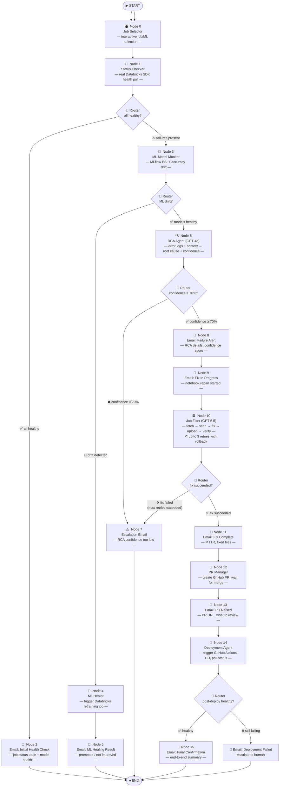
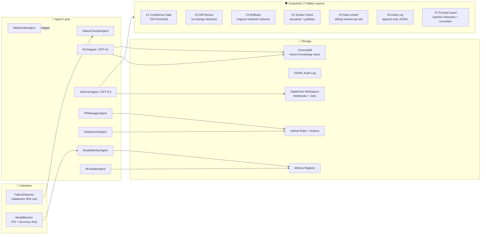
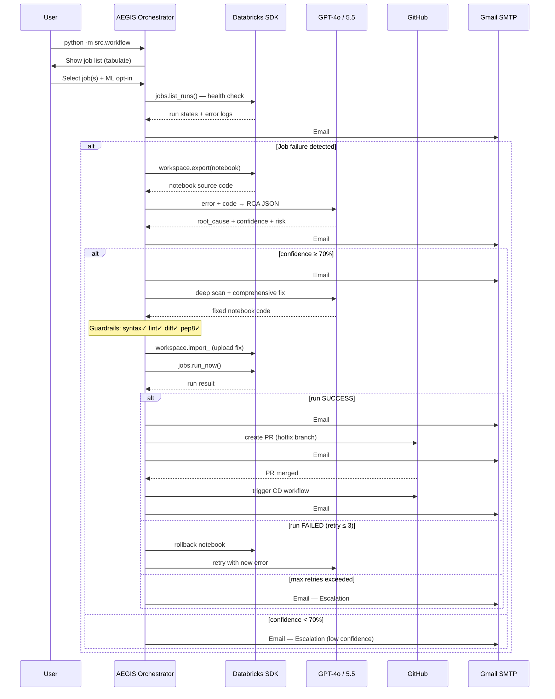
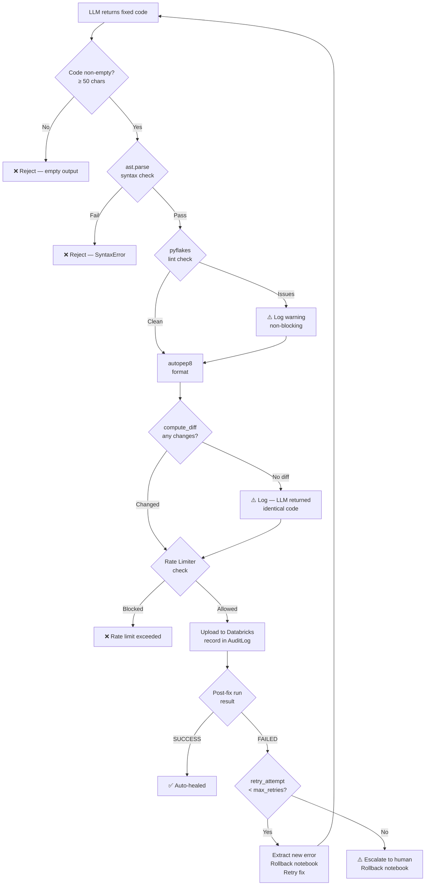

# AEGIS — System Architecture

> **AI-Engine for Guardian Intelligence & Self-healing**  
> Hackathon Track: Self-Healing Data & ML Systems | AI-Autonomous Reliability Engineer

---

## Overview

AEGIS is a fully autonomous reliability system for Databricks-based Data & ML pipelines. It implements a closed-loop **DETECT → DIAGNOSE → DECIDE → HEAL → REPORT** cycle using a 15-node LangGraph multi-agent workflow.

---

## 15-Node LangGraph Workflow



---

## Component Map



---

## Data Flow: Full Autonomous Healing Cycle



---

## Guardrail Decision Tree



---

## Technology Stack

| Layer | Technology |
|---|---|
| **Orchestration** | LangGraph (15-node async state machine) |
| **LLM (RCA)** | GPT-4o via EPAM DIAL (Azure OpenAI proxy) |
| **LLM (Code Fix)** | GPT-5.5 via EPAM DIAL |
| **Pipeline Platform** | Databricks SDK + DAB (Databricks Asset Bundles) |
| **ML Registry** | MLflow |
| **Vector Store** | ChromaDB (persistent, lightweight embeddings) |
| **CI/CD** | GitHub Actions (ci.yml + cd.yml) |
| **Notifications** | Gmail SMTP (8 lifecycle stages) |
| **Teams** | Microsoft Teams Webhook |
| **Config** | YAML + python-dotenv (env-var expansion) |
| **Validation** | pyflakes + autopep8 + ast.parse |
| **Audit** | Append-only JSONL |
| **Testing** | pytest + pytest-asyncio |

---

## Security Architecture

| Guardrail | Mechanism | Where |
|---|---|---|
| Confidence Gate | Blocks auto-heal if RCA confidence < 70% | `workflow.py`, `policy_engine.py` |
| Prompt Injection Guard | Truncation + pattern detection + injection-resistant system message | `guardrails/prompt_guard.py` |
| Code Syntax Validation | `ast.parse` + `compile()` before upload | `guardrails/validators.py` |
| Lint Gate | pyflakes static analysis | `guardrails/validators.py` |
| Diff Check | Rejects identical code (no-op LLM output) | `guardrails/validators.py` |
| Rate Limiter | Max 5 triggers / 10 min per job (sliding window) | `guardrails/rate_limiter.py` |
| Rollback | Original notebook restored on post-fix failure | `agents/job_fixer.py` |
| Audit Log | Every action recorded to immutable JSONL | `guardrails/audit_log.py` |
| Env-var secrets | No credentials in source — `.env` only | `.env.example`, `config.yaml` |

---

## Directory Structure

```
aegis/
├── src/
│   ├── main.py                  # AEGISOrchestrator (legacy event loop)
│   ├── workflow.py              # LangGraph 15-node multi-agent workflow
│   ├── models.py                # Shared data models (dataclasses + enums)
│   ├── agents/
│   │   ├── status_checker.py    # Databricks job health polling
│   │   ├── job_fixer.py         # GPT-5.5 notebook repair (5-phase)
│   │   ├── pr_manager.py        # GitHub PR creation + merge polling
│   │   ├── deployment.py        # GitHub Actions CD trigger + monitoring
│   │   ├── mail_sender.py       # 8-stage Gmail notifications
│   │   ├── model_monitor.py     # MLflow PSI + accuracy drift detection
│   │   └── ml_healer.py         # Autonomous retraining + promotion
│   ├── diagnosis/
│   │   ├── rca_agent.py         # GPT-4o root cause analysis
│   │   └── context_assembler.py # Multi-signal context gathering
│   ├── detection/
│   │   └── failure_detector.py  # Simulation + production detector
│   ├── healing/
│   │   ├── heal_orchestrator.py # Failure-type → action routing
│   │   └── policy_engine.py     # Confidence + risk gate
│   ├── guardrails/
│   │   ├── prompt_guard.py      # Prompt injection defence (Guardrail #7)
│   │   ├── validators.py        # Syntax / lint / diff / format (Guardrails #2, #4)
│   │   ├── rate_limiter.py      # Sliding-window trigger throttle (Guardrail #5)
│   │   └── audit_log.py         # Append-only action log (Guardrail #6)
│   ├── knowledge/
│   │   └── incident_store.py    # ChromaDB vector store for past incidents
│   └── reporting/
│       ├── incident_report.py   # Structured report generation
│       ├── incident_reporter.py # IncidentReporter facade
│       ├── gmail_notifier.py    # HTML email builder
│       ├── pr_creator.py        # GitHub PR body builder
│       └── teams_notifier.py    # Teams webhook
├── de_project/                  # Databricks Asset Bundle
│   ├── databricks.yml
│   ├── notebooks/               # Sample + intentionally broken notebooks
│   └── resources/jobs/          # Job definitions (YAML)
├── tests/                       # Full test suite
│   ├── conftest.py
│   ├── test_policy_engine.py
│   ├── test_validators.py
│   ├── test_rate_limiter.py
│   ├── test_audit_log.py
│   ├── test_prompt_guard.py
│   ├── test_rca_agent.py
│   ├── test_heal_orchestrator.py
│   ├── test_incident_store.py
│   └── test_integration_smoke.py
├── config/config.yaml           # Runtime config (env-var expanded)
├── .env.example                 # Environment variable template
├── .github/workflows/
│   ├── ci.yml                   # Lint notebooks + validate DAB bundle
│   └── cd.yml                   # Deploy to Databricks on PR merge
└── docker-compose.yml           # Container config
```
